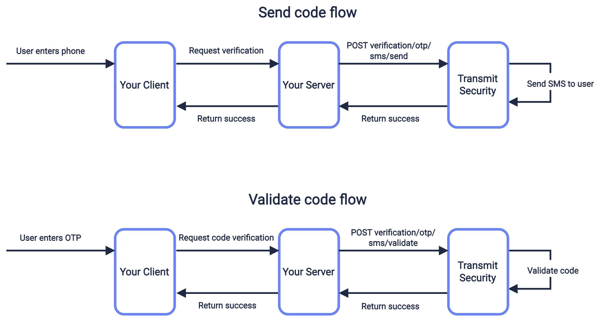

# SNS (Origination Number)
1. Go to AWS SNS Page
2. On Left Menu > Mobile > `Origination Number`
3. Click `Provision numbers in Pinpoint`

4. Click `Request Phone Number`

5. Select the Country
6. Select Tool-free
7. Make sure voice and SMS are checked
8. Select Default message type > Transactional

9. Click the Phone number and you'll be redirected to AWS Pinpoint page
10. Click on left Menu > Configurations > Registrations
11. Click `Create Registration`

12. Add name on field `Registration friendly name`
13. Registration Type > `US tool-free number registration`
14. On `Available toll-free numbers` select the number
15. Click Create

16. Fill the `Company info` form
17. Click Next
18. Fill the `Contact info` form
19. Click Next
20. Fill the `Message use case` form
    _**NOTE**_: On `Use case details` and `Opt-in workflow description` be as much specific as possible  
    _**NOTE2**_: You are required to send an otp-in workflow, use this image  
    
21. Click Next
22. Sample message
```
Hello, new OTP (OneTimePassword) XXXXXX for application XYZ
```
23. Click Next
24. Click Submit Registration
25. Wait until the the number is provisioned (can take up to 15 days)

# SNS Configuration
1. Go to AWS SNS Page
2. On Left Menu > Mobile > Text Messaging (SMS)
3. Scroll down to `Sandbox destination phone number`
4. Click `Add Phone number`

5. type your phone number
6. Select a language
7. Click `Add phone number`