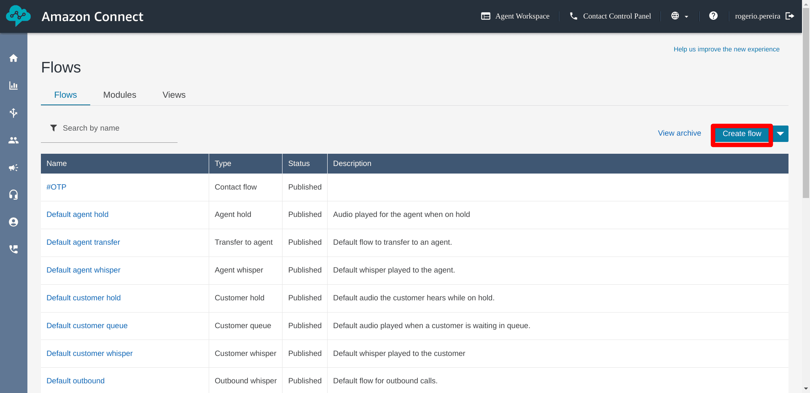
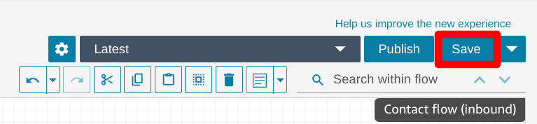

# SNS (Origination Number)
1. Go to AWS SNS Page
2. On Left Menu > Mobile > `Origination Number`
3. Click `Provision numbers in Pinpoint`
    
4. Click `Request Phone Number`
    
5. Select the Country
6. Select Tool-free
7. Make sure voice and SMS are checked
8. Select Default message type > Transactional
    
9. Click the Phone number and you'll be redirected to AWS Pinpoint page
10. Click on left Menu > Configurations > Registrations
11. Click `Create Registration`
    
12. Add name on field `Registration friendly name`
13. Registration Type > `US tool-free number registration`
14. On `Available toll-free numbers` select the number
15. Click Create
    
16. Fill the `Company info` form
17. Click Next
18. Fill the `Contact info` form
19. Click Next
20. Fill the `Message use case` form  
    _**NOTE**_: On `Use case details` and `Opt-in workflow description` be as much specific as possible  
    _**NOTE2**_: You are required to send an otp-in workflow, use this image  
    
21. Click Next
22. Sample message
```
Hello, new OTP (OneTimePassword) XXXXXX for application XYZ
```
23. Click Next
24. Click Submit Registration
25. Wait until the the number is provisioned (can take up to 15 business days) (for me it took 14 business day, 21 day in total)

# SNS Configuration (Sandbox phone)
_**NOTE**_: Do this step only after the phone number requested in SNS (Origination Number) is active
1. Go to AWS SNS Page
2. On Left Menu > Mobile > Text Messaging (SMS)
3. Scroll down to `Sandbox destination phone number`
4. Click `Add Phone number`
    
5. type your phone number
6. Select a language
7. Click `Add phone number`
8. Go to AWS SNS Page
9. On Left Menu > Mobile > Text Messaging (SMS)
10. Scroll down to `Sandbox destination phone number`
11. Select the phone number
12. Click verify Phone Number
13. Type the code sent to that number

# AWS Connect Configuration
1. Go to AWS Connect Page
2. Click Add Instance
3. `Identity` Page
4. Select `Store users in Amazon Connect`
5. Type an URL  
    eg. connect
6. Click Next
    
7. `Administrator` Page
8. Select Specify Administrator
9. Fill fields:  
    a. `First Name`  
    b. `Last Name`  
    c. `Username`  
    d. `Password`  
    e. `Password (verify)`  
    f. `Email`
10. Click Next
    
11. `Telephony` Page
12. Uncheck `Allow incoming calls`
13. Click Next
    
14. `Data Storage` Page
15. Copy `Connect Data` bucket
16. Copy `Flow Logs` cloudwatch
17. Click Next
    
18. Review and Create Page
19. Click Create Instance
20. Wait until everything is created
21. Click your access URL
    

# AWS Connect
1. Fill username and password and click `Sign In`  
    _**NOTE**_: Defined in `AWS Connect Configuration` > Step 9.c and 9.d
    
2. In section `Explore you channels of communications`
3. Click Begin
    
4. Select `Tool free` in `Type` field
5. Select Country
6. The phone number will be selected automatically
    _**NOTE**_: This phone number isn't related to SNS (Origination Number)
7. Click Next
8. Click Continue
9. On Connect Home, scroll down to `Create Queues` section
10. Click `View queues`
    
11. Click `BasicQueue`
    
12. Scroll down to `Outbound caller configuration`
13. Fill `Default Caller ID`
14. Select phone number in `Outbound caller ID number`
15. Click Save
    
16. Click `BasicQueue` again
17. Click `Show additional queue information`
    
18. You’ll get an ARN in the form of `arn:aws:connect:<region>:<account-id>:instance/<instance-id>/queue/<queue-id>`
19. Copy `instance-id` and `queue-id` and update .env (see below)
20. On Connect Home, scroll down to `Create flows` section
21. Click `View flows`
    
22. On the arrow next to `Create Flow`
23. Click `Create outbound whisper flow`
    
24. Enter a flow name
25. Search, drag and drop `Play prompt`
26. Click the three dots and `Edit Settings`
27. Select `Text to speech or chat text`
28. Select `Set Dynamically`
29. Select `User defined` in namespace
30. Type `message` in `key`
31. Select `SSML` in Interpret as
32. Click Save  
    
33. Connect Start with `Play prompt block`
34. Search, drag and drop `Get Customer input`
35. Click the three dots and `Edit Settings`
36. Select `Text to speech or chat text`
37. Select `Set Manually`
38. Enter text
    ```
    <speak>Press 1 to repeat.</speak>
    ```
39. Select `Text` in Interpret as
40. Click `DTMF`
41. Set timeout as `5`
42. Click `Add condition`
43. Type `1`
44. Type `Enter`
45. Click Save  
      
      
    
46. Search, drag and drop `End flow`
47. Connect blocks as follows
    
48. Click Save  
    
49. Click Publish  
    
50. Click `Show additional flow information`
    
51. You’ll get an ARN in the form of `arn:aws:connect:<region>:<account-id>:instance/<instance-id>/contact-flow/<contact-flow-id>`
52. Copy `contact-flow-id` and update .env (see below)


# Update .env file
```
AWS_CONNECT_INSTANCE_ID=<AWS CONNECT, step 19>
AWS_CONNECT_QUEUE_ID=<AWS CONNECT, step 19>
AWS_CONNECT_CONTACT_FLOW_ID=<AWS CONNECT, step 52>
```